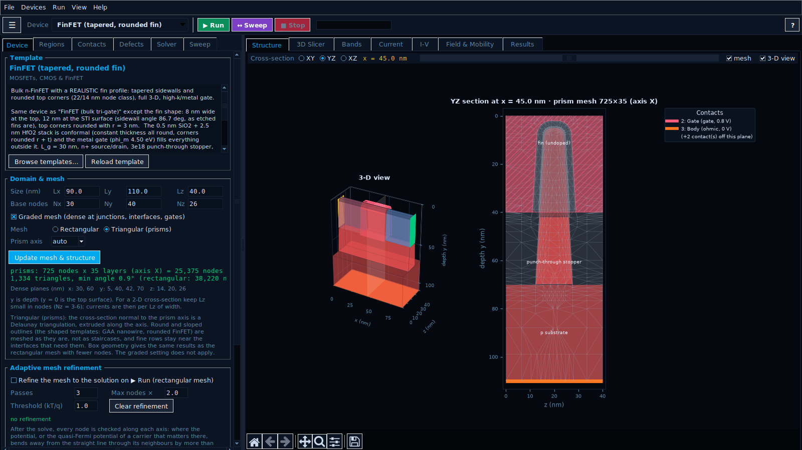
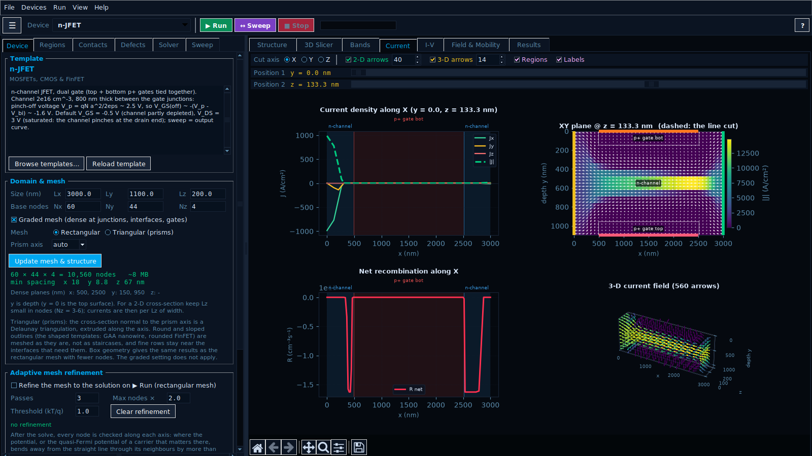
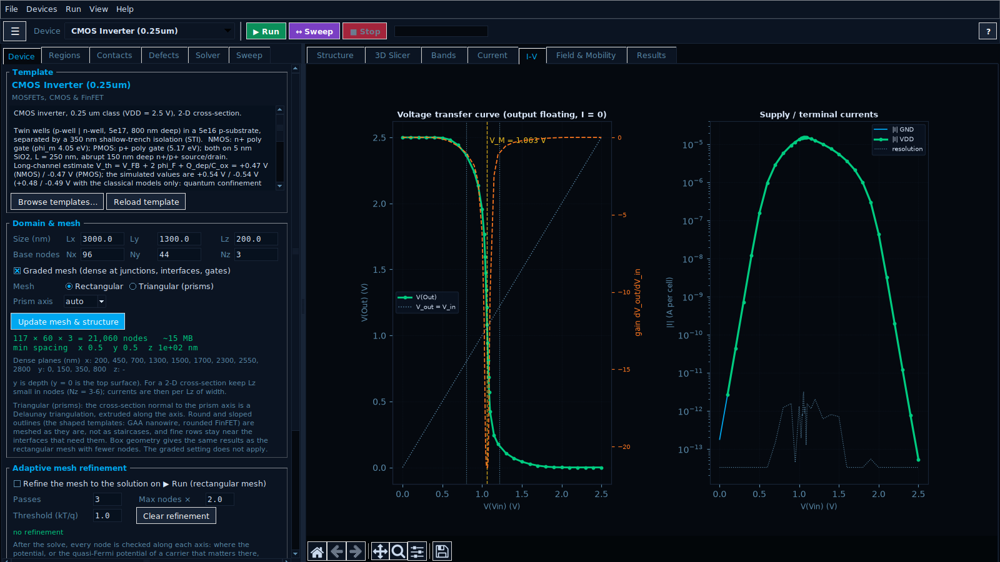
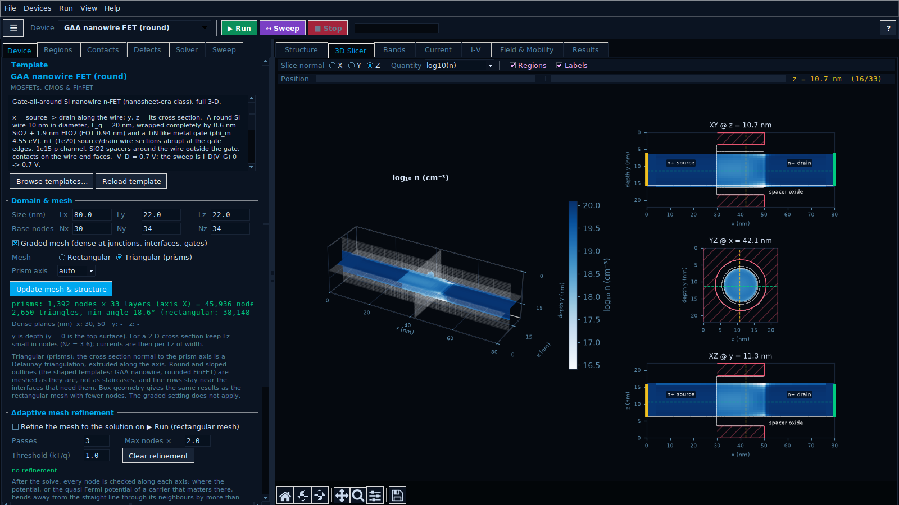
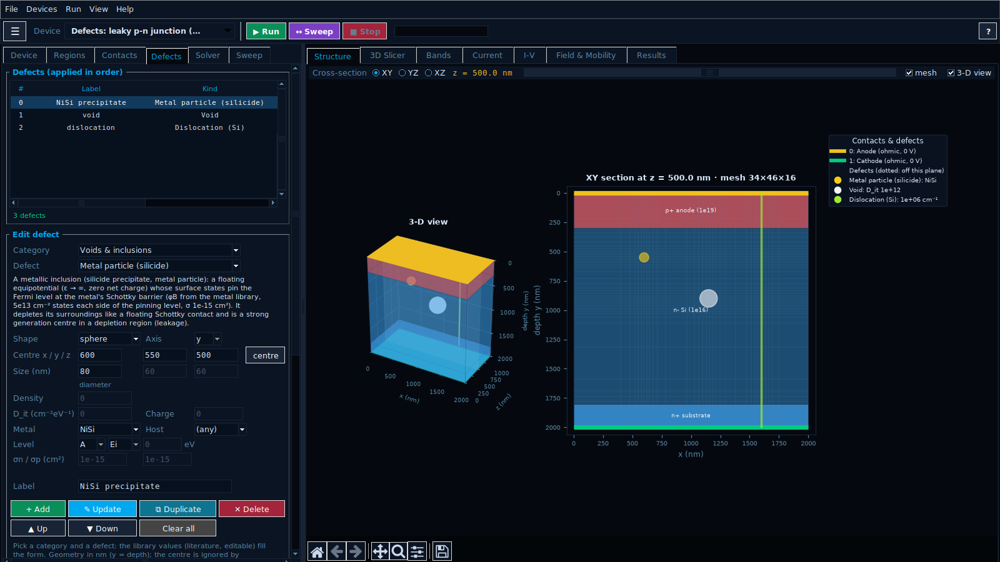

# SemiSim 3D v0.1 (public) — README, changelog, manual and sources

Public repository: https://github.com/kotmariusz/Semiconductor_devices_simulator (private while being set up). v0.1 = the first public version, a test version (internally the 7.6 line: 7.6 code + Ge/InP parameter fixes). No licence: free to use, copy, change and share, no warranty. Validation: 167/167 (gcc, --templates); default battery 120/120 also with clang + libomp.

---

# SemiSim 3D — semiconductor device simulator (v0.1)

A 3-D drift-diffusion simulator for semiconductor devices with a desktop
interface: build a device from blocks of material and doping, solve it, and
look at its bands, fields, current flow and I-V curves. A C core (OpenMP)
does the numerics; the interface is Python/Tk. 47 ready-made devices are
included: diodes, BJTs, MOSFETs, FinFETs, a CMOS inverter, JFETs, GaN HEMTs,
Si and SiC power devices, solar cells, LEDs and photodiodes.

> **v0.1 is the first public version and a test version.** It is still being
> tested and its results can be wrong - see [Status](#status).



| | |
|---|---|
|  |  |
|  |  |

## Install

**Windows (WSL2) and Linux** - in an Ubuntu / WSL terminal:

```bash
sudo apt update && sudo apt install -y git
git clone https://github.com/kotmariusz/Semiconductor_devices_simulator.git
cd Semiconductor_devices_simulator
bash install.sh
```

**macOS** - first `xcode-select --install` and Python from
[python.org](https://www.python.org/downloads/macos/) (or Homebrew), then in
Terminal:

```bash
git clone https://github.com/kotmariusz/Semiconductor_devices_simulator.git
cd Semiconductor_devices_simulator
bash install.sh
```

`install.sh` installs what is missing, builds the solver and runs a short
self-test. Start the program with `semisim3d` (in a new terminal) or
`python3 main.py`; on macOS also by double-clicking `SemiSim3D.command`.
Update with `git pull`. Details: [docs/MANUAL.md](docs/MANUAL.md#install).

## First steps

1. Pick a device in the `Device ▾` menu.
2. `▶ Run` (F5) solves it - look at the Bands, Current and Field tabs.
3. `↔ Sweep` (F6) runs an I-V sweep; `■ Stop` (Esc) stops.
4. Change regions, contacts or defects in the editor and run again.

F1 opens the help. F11 fills the screen (on WSL use it instead of the
maximise button). On a Mac, ⌘R runs and ⌘. stops.

## Status

- The physics is checked against textbook theory (`validate.py`, 167
  checks), not yet against measurements of real devices.
- Results can be wrong, and avalanche breakdown, band-to-band tunnelling,
  light, self-heating and transients are not modelled
  ([Limitations](docs/MANUAL.md#limitations)). Check anything important
  independently.
- `RW:` devices follow the class and ratings of real parts, not their dies.
- macOS support is new and lightly tested.

Problems and ideas:
[Issues](https://github.com/kotmariusz/Semiconductor_devices_simulator/issues)
(attach the saved device and the output of `python3 semibuild.py --check`).

## Documentation

- [docs/MANUAL.md](docs/MANUAL.md) - user manual (also Help, F1)
- [docs/SOURCES.md](docs/SOURCES.md) - all sources: models, parameters, devices, tests, software
- [CHANGELOG.md](CHANGELOG.md) - versions

## Use and sharing

Free to use, copy, change and share for any purpose, without asking. No
licence, no conditions, no warranty.

---

# Changelog

## 0.1 (2026-10-08) - first public version (test version)

The first public release. SemiSim 3D was developed privately before this
(internal versions 7.x); 0.1 starts the public numbering.

- 3-D drift-diffusion core in C with OpenMP: box method on graded
  rectangular meshes or triangular prisms, Scharfetter-Gummel fluxes,
  Newton-Poisson with multigrid CG, BiCGSTAB with aggregation multigrid, a
  Gummel map with Anderson acceleration, adaptive bias continuation with a
  sweep predictor, adaptive mesh refinement.
- Physics: heterojunctions, band-gap narrowing, doping- and field-dependent
  mobility with surface mobility, SRH/Auger/radiative recombination, quantum
  confinement (MLDA), gate tunnelling, metal contacts with real barrier
  heights, GaN polarisation, defects (deep levels, interface traps, voids,
  particles, dislocations, radiation damage).
- Python/Tk interface: device editor, 47 templates, bias points and sweeps,
  nets and floating terminals, 3-D structure and solution views, I-V
  analysis, help with the full manual.
- Linux, WSL2 and macOS: `install.sh`, automatic build of the core
  (`semibuild.py`), CI on Ubuntu and macOS.
- Validation: `validate.py`, 167 checks against closed-form theory.

Known gaps: see Limitations in [docs/MANUAL.md](docs/MANUAL.md#limitations).

---

# SemiSim 3D 0.1 — user manual

The long form of the program's Help (F1). Short version: [README](../README.md);
every reference: [SOURCES](SOURCES.md).

**Status.** 0.1 is the first public version and it is still being tested. The
physics is checked against textbook theory (see Validation), not yet against
measurements of real devices; the effects under Limitations are not modelled.
Check important results independently. Free to use, copy, change and share -
no licence, no warranty.

SemiSim 3D solves Poisson's equation and the electron and hole continuity
equations (drift-diffusion, box method, Scharfetter-Gummel fluxes) in 3-D. A
device is built from blocks of material and doping - boxes, or boxes cut to a
round or sloped outline - on one of two meshes: a graded rectangular grid
(refined at junctions, gates and interfaces, and on request adapted to the
solution), or triangular prisms (`semimesh.py`) that follow round and sloped
interfaces. The core (`semiconductor_3d.c`, OpenMP) returns bands, quasi-Fermi
levels, fields, currents, mobilities, recombination and trapped charge; the
interface (`main.py`, Python/Tk) builds the device, runs bias points and sweeps
and draws the results. The 47 templates range from textbook diodes to FinFETs,
a CMOS inverter, SiC/GaN power devices and parts modelled on real components
(device class only - not their real dies).

## Install

Windows (WSL2 with Ubuntu) and Linux, in a terminal:

```bash
git clone https://github.com/kotmariusz/Semiconductor_devices_simulator.git
cd Semiconductor_devices_simulator
bash install.sh
```

macOS: first `xcode-select --install` (the compiler) and Python from
[python.org](https://www.python.org/downloads/macos/) or Homebrew, then the
same three commands in Terminal.

`install.sh` installs what is missing (Python 3.8+ with Tk 8.6+, NumPy,
Matplotlib, a C compiler - on Linux from the distribution, with sudo; on macOS
in a virtual environment `.venv`, plus Homebrew's `libomp` for multi-core
solving), builds the solver core (`semibuild.py`), runs a short self-test and
adds the command `semisim3d` - on Linux also a menu entry (on WSL2 in the
Windows Start menu), on macOS `SemiSim3D.command` to double-click. Options:
`PYTHON=/path/to/python3`, `SEMISIM_VENV=1` (Linux: pip instead of system
packages), `NO_OPENMP=1` (macOS: no libomp).

Start: `semisim3d`, or `python3 main.py` in the folder. Update: `git pull` -
the core rebuilds itself on the next start.

By hand: `python3 -m pip install -r requirements.txt`, `python3 semibuild.py`
(`--portable` for any CPU of this kind, `--check` to see the compiler and
OpenMP in use), `python3 main.py`.

Notes: native Windows is not supported (use WSL2). macOS's own
`/usr/bin/python3` (Tk 8.5) does not work; Tk 9 needs Matplotlib 3.10+. Without
OpenMP the core runs on one core. The solver uses all cores (on Apple silicon
the performance cores); Solver page → CPU threads. A core built for one CPU
should not be copied to another computer (`main.py` rebuilds it when needed).

## Using the GUI

The window adapts to the screen: 1280×720 and larger work, and the layout is
remembered between sessions (in `~/.semisim3d.json`). F11 (View → Fill the
screen / restore) makes the window as large as the screen and back; View →
Reset window size brings back the default.

**WSL2 (WSLg) and maximised windows.** WSLg sends the mouse clicks of a
maximised Linux window to the wrong place: after the maximise button the
buttons stop responding, while a drag on a plot still turns the 3-D view.
A normal window as large as the screen does not have the problem, so on WSL
SemiSim turns a maximise (the button, a double click on the title bar,
Win+↑) into F11: the window is un-maximised and given the same rectangle.
View → `WSL: turn maximise into fill screen` switches this off.

```
┌ File  Devices  Run  View  Help ──────────────────────────────────────────────┐
│ ☰  Device [CMOS Inverter ▾]  ▶ Run  ↔ Sweep  ■ Stop  [████░░] point 7/26…   ? │
├──────────── editor (drawer) ───────┬── plots ─────────────────────────────────┤
│ Device│Regions│Contacts│Defects│   │ Structure│3D Slicer│Bands│Current│I-V│… │
│ Solver│Sweep                       │                                          │
│  (every page scrolls both ways;    │   (matplotlib toolbar under every plot)  │
│   wheel / Shift+wheel)             │                                          │
└────────────────────────────────────┴──────────────────────────────────────────┘
```

**Toolbar**

* `☰` (Ctrl+E; ⌘E on a Mac) hides the editor so the plots get the whole window. Drag the
  divider to resize the editor.
* `Device ▾` opens the template library by category. Help → Template library
  shows the full description of each device.
* `▶ Run` (F5) solves at the contact voltages. `↔ Sweep` (F6) runs the sweep.
  `■ Stop` (Esc) stops within one Gummel iteration and keeps the last
  converged bias point.
* The progress bar tracks the bias ramp or the sweep points. Beside it are
  the continuation step, the Gummel iteration and the residual.

**Editor pages**

* `Device`: the template description, domain, base mesh, the mesh type
  (`Rectangular` or `Triangular (prisms)`, with the prism axis), adaptive
  mesh refinement and the final mesh statistics.
* `Regions` and `Contacts`: scrollable tables. Select a row to edit it. A
  contact can be made of a metal (`Metal`; see below).
* `Defects`: the defect table, the defect form (library preset, shape, size,
  density, levels) and random scatter (see Defects).
* `Solver`: temperature, physical models (band-gap narrowing, τ(N), velocity
  saturation, quantum confinement, Lombardi surface mobility, gate
  tunnelling, metal-contact thermionic emission and barrier tunnelling), the
  background SRH lifetime, iteration limits, tolerances and CPU threads. Each
  template sets the model switches it was designed with.
* `Sweep`: the swept terminal, range and points, a floating terminal and the
  plotted current.

**Plot tabs**

* Structure (3-D view plus an XY/YZ/XZ cross-section with the real mesh -
  grid lines, or the triangles of a prism mesh; outlines drawn as they are;
  defects filled where the plane cuts them and dotted otherwise; hover to
  read the region and defect under the cursor), 3-D Slicer, Bands, Current,
  I-V, and Field & Mobility.
* `Results`: every terminal's applied and solved voltage, current, current
  density and resolution, the parameters extracted from the last sweep, and a
  run log.
* `Current`: the number boxes next to `2-D arrows` and `3-D arrows` set how
  many current arrows are drawn - in the in-plane map the arrows across it
  (4-120, the rows follow the map's shape), in the 3-D field the arrows along
  x (2-40; depth y gets 3/4 and z 5/8 of them, never more than the mesh
  lines along an axis, at most 4000 arrows). The current is interpolated
  between the mesh nodes, so the count is not limited by the mesh; denser
  arrows are drawn shorter and thinner. Arrow length is log-scaled, so weak
  and strong currents both show.
* Region labels sit where they fit and never cover each other, the line cuts
  mark the regions they cross in a strip above the curves, and the semi-log
  I-V panel spans the currents that matter (a curve far below them is listed
  as "below the axis" instead of squeezing the plot).

**Settings and shortcuts**

* Text size: View → Text size, or Ctrl + / Ctrl − / Ctrl 0 (⌘ on a Mac). Plot
  labels scale too.
* Keys: F1 help, F5 run, F6 sweep, Esc stop, F11 fill the screen, Ctrl+E
  editor, Ctrl+O / Ctrl+S open / save the device, Ctrl+Q quit. On a Mac the
  Ctrl shortcuts use ⌘, and since F5 needs the fn key there, ⌘R runs and ⌘.
  stops.
* Help (F1) is a scrollable manual with a topic list and search.
* File → Save/Open device stores the whole editor state as JSON (defects and
  the adaptive mesh lines included). Export solution/sweep CSV and the
  visible plot (PNG/PDF/SVG) are also in the File menu.

**Gate stacks.** A gate on a semiconductor face takes an optional layer
stack in the Contacts page, semiconductor side first, in nm:
`SiO2 0.5, HfO2 2.5`. The gate capacitance then uses the stack's EOT, and
gate tunnelling sees every layer. A box gate (a metal electrode inside
meshed insulator regions) needs no stack.

**Nets.** Contacts with the same `Net` name are wired together outside the
simulated cell: the NMOS and PMOS gates of an inverter, the three sides of a
FinFET gate, a source tied to the substrate. A net carries one voltage, is
swept as one terminal, and its currents are summed in the plots.

**Floating terminal (I = 0).** In the Sweep page any contact or net can be
floating: at every point its voltage is solved so that its total current is
zero (a bracketed secant on the continued solution). This turns a sweep into
a transfer curve (the inverter's unloaded output). With `Adaptive
refinement`, steep parts of the curve get extra points automatically.

**Extracted parameters** (I-V and Results tabs): diode ideality and J₀; for
gate sweeps SS, V_th (maximum-g_m extrapolation, plus constant current
100 nA·W/L where the template gives W/L) and I_on/I_off; for gate-current
sweeps the peak J_G and J_G at ±0.5 and ±1 V; for transfer curves V_M, the
maximum gain, V_OH/V_OL, V_IL/V_IH, the noise margins and the peak supply
current; a heuristic current knee for blocking sweeps.

## Contact metals

Contacts page → `Metal`: Al, Ti, Ag, Cr, W, Mo, Cu, Au, Pd, Ni, Pt, TiN, TaN,
TiSi2, CoSi2, NiSi, PtSi, ErSi2, n⁺/p⁺ poly-Si, or `(ideal / custom φm)`.
The line under the field shows the barrier the metal forms on the
semiconductor under the contact and its source:

* **measured** barrier heights on n-type Si, GaAs, 4H-SiC and GaN (Sze & Ng;
  the SiC/GaN contact literature), e.g. Al/n-Si 0.72 eV, Ti/n-Si 0.50,
  PtSi/n-Si 0.84, Ni/4H-SiC 1.5 eV;
* the **Cowley-Sze pinning model** for any other pair:
  φBn = S(φm − χ) + (1 − S)φpin (Si S = 0.27, φpin 0.80 eV; GaAs strongly
  pinned, S ≈ 0.07; SiC and GaN S ≈ 0.4).

The hole barrier is Eg − φBn. On a semiconductor face both `Ohmic` and
`Schottky` contacts with a metal become physical metal contacts (Solver page,
two switches, on by default):

* **Thermionic emission** with the Richardson velocity v = A**T²/(qN_c,v)
  against the density in equilibrium with the metal, over a barrier lowered
  by the **image force** - flat up to x_m = Δφ/2F, −q/16πεx beyond - which is
  part of the band the carriers drift and diffuse in, screened by the free
  carriers (Debye length). Together this is Crowell-Sze
  thermionic-emission-diffusion; reverse currents keep rising with voltage as
  on real diodes.
* **Tunnelling through the barrier** (field and thermionic-field emission):
  Tsu-Esaki current with WKB transmission through the band along the contact
  normal, injected where the carriers leave the barrier. It makes a metal on
  heavily doped silicon ohmic: ρc ≈ 1e-7…1e-6 Ω·cm² on 1e20 cm⁻³.

A `Gate` with a metal takes the metal's work function. A Box contact keeps
an ideal ohmic contact (Ohmic) or the fixed barrier (Schottky). Real barriers
vary by ±0.1 eV with surface preparation: type φm to override.

## Defects

The `Defects` page puts defects into any device. A defect is a physical
effect from the library (literature values, every number editable) placed in
a shape.

**What a defect does**

* **Deep levels (traps):** SRH recombination through the level (any energy,
  its own capture cross sections, thermal velocities from the effective
  masses) and the charge it holds: an acceptor is negative when it holds an
  electron, a donor positive when empty. The occupancy follows the local
  electron and hole densities (steady state) and enters Poisson's equation -
  traps compensate doping, deplete regions and shift thresholds. A neutral
  level only recombines.
* **Interface traps, D_it** (cm⁻²eV⁻¹): a constant density across the gap at
  the semiconductor/insulator interfaces inside the shape and under face
  gates, as 24 levels (acceptor-like above midgap, donor-like below).
* **Fixed charge:** at interfaces (q/cm², oxide charge) or in a volume.
* **Inclusions:** the shape becomes another material - a void (ε = 1), SiO2
  (oxide precipitate) or a metal particle (ε → ∞, a floating equipotential) -
  with interface states on its surface. A metal particle's states pin the
  Fermi level at its Schottky barrier on that semiconductor: it depletes its
  surroundings like a floating Schottky contact and recombines like one.
* **Extended defects:** dislocations (states per cm of line), stacking
  faults and grain boundaries (states per cm², or a D_it band).
* **Radiation damage:** neutron fluence (the three-level Perugia model for
  p-type FZ Si, level densities η·Φ) and total ionizing dose (oxide charge +
  D_it).

**Library (26 presets)**

| Category | Presets |
|---|---|
| Voids & inclusions | void, oxide precipitate (SiO2), metal/silicide particle (any metal), Cu3Si precipitate, COP (crystal-originated void), micropipe (4H-SiC) |
| Point defects & contamination | custom deep trap, interstitial iron Fe_i (Ev + 0.38 eV), FeB pair (Ec − 0.23), gold (Ec − 0.55 / Ev + 0.35), platinum (Ec − 0.23 / Ev + 0.32) |
| Radiation damage | neutron fluence (Perugia), ionizing dose |
| Interfaces | Si/SiO2 D_it, 4H-SiC/SiO2 (D_it + near-interface acceptor traps), oxide fixed charge, volume charge |
| Extended defects | dislocation (Si), threading dislocation (GaN), stacking fault (4H-SiC), grain boundary (poly-Si) |
| SiC · GaN · GaAs | Z1/2, EH6/7 (SiC lifetime killers), C_N and Fe_Ga (semi-insulating GaN buffers), EL2 (GaAs) |

The description under the selection gives each value and its source.
Measured capture cross sections scatter by up to 10× (more for Pt): treat
them as starting points.

**Placement.** Shapes: sphere (diameter), box (dx, dy, dz), cylinder
(diameter, length along its axis, 0 = through the device), slab (thickness
along its normal axis, widths, 0 = across), everywhere (the whole host
material). `Host` limits a defect to one semiconductor. Manual: fill the form
and `+ Add`. Random: `Random scatter` places copies of the form's defect at
random centres in a box - a number, or a density (per cm³ of the box; per cm²
for lines through the device, e.g. a threading-dislocation density) - with a
seed (same seed, same layout) and a size spread; the copies form a group that
`Remove group` deletes at once.

**Exactness on any mesh.** The number of states is exact whatever the mesh:
deep levels in a shape smaller than the cells are spread over the nearest
nodes, a dislocation over the nearest row, and interface states carry the
true surface area of the shape (the cell faces around a meshed sphere add up
to ~1.5× its area). An inclusion replaces whole control volumes, so the
graded mesh is made denser through the first 40 inclusions, lines and planes
(boxes get exact faces); one smaller than the cells around it acts through
its surface states only, and the Defects page says so after a run.

**Background lifetime.** Solver page → `Background SRH τ0`: the lifetime of
the built-in midgap recombination (empty = material default, Si 10 µs; `1e-3`
= float-zone silicon; `none` = only the defects recombine).

**Seeing them.** The Structure tab draws every defect; solution maps outline
the ones the plane cuts (with `Regions` on); 3D Slicer quantities `trap
density` and `trapped charge`.

## Adaptive mesh refinement

Device page → `Refine the mesh to the solution on ▶ Run` (rectangular mesh).
After the solve, every node is checked along each axis: how far the
electrostatic potential, the band edges the carriers move in (with
band-gap narrowing and the quantum-confinement potential) and the
quasi-Fermi potentials of the carriers that matter there bend away from the
straight line through the two neighbours, in kT/q. Where that exceeds the
threshold (default 1 kT/q) the mesh does not resolve the solution - an
unresolved depletion edge, an inversion layer, current crowding - and the
interval is split into √(deviation/threshold) parts. The device is solved
again from the old solution interpolated onto the new mesh (from equilibrium
if that fails to converge), for up to `Passes` rounds or until the node
budget (`Max nodes ×` the unrefined count) is used; the largest deviations
are refined first. Uniform fields and resistors need no refinement and get
none. The added lines stay for sweeps and later runs until `Clear
refinement` or another template, and are saved with the device.

How it does (validate.py section 16, and a survey of the templates at their
default bias against meshes 2.5× finer in x and y):

| Device | Default mesh | After refinement (3 passes, ≤ 2× nodes) |
|---|---|---|
| p⁺/n diode on a coarse uniform mesh (15 nodes / 10 µm), I(0.5 V) | +3.0 % | +0.04 % (36 lines) |
| the same at 0.7 V | +3.6 % | +0.11 % |
| n-JFET template, drain current | +7.6 % | +0.9 % |
| NMOS template, linear region (V_G 1.5 V, V_D 50 mV) | +0.37 % | −0.06 % |
| PN Diode (+0.15 %) and Schottky (+0.5 %) templates | resolved | no lines added |
| PIN diode at 0.8 V (high injection) | −2.1 % | not flagged: no lines added |

It is not a cure-all: the subthreshold current of a short MOSFET with
quantum confinement depends on where the MLDA potential ends at the gate edge
(a model discontinuity no mesh resolves), and a few templates moved by a
similar small amount in the other direction (BJT −0.8 → +1.6 %). Compare
with a uniformly finer mesh when it matters.

## Validation

`python3 validate.py` runs 120 checks against closed-form theory (about 5 min
on two cores); `--templates` adds section 9: all 167 checks in about 10 min.
Each check prints PASS/FAIL with its tolerance, and the script doubles as an
example of driving the core without the interface. The references are in
[SOURCES](SOURCES.md).

| § | Test | Result |
|---|---|---|
| 1 | Si p-n junction in equilibrium: built-in potential, np = nᵢ² | exact (1e-11 V, 1e-14) |
| 2 | Abrupt junction, 1–60 V: depletion width vs depletion approximation | within 0.05 % |
| 3 | Long-base p⁺/n diode vs Shockley theory, 0.45–0.55 V | within 0.5 % |
| 4 | 4H-SiC blocking junction to 2 kV: peak field | within 0.34 % |
| 5 | AlGaAs/GaAs and AlGaN/GaN heterojunctions: Vbi, ΔE_c = Δχ | exact |
| 6 | MOS capacitor: flat band, ψₛ(V_T) = 2φ_F, inversion charge | 0.06 mV; dQ/dV = 0.96 C_ox |
| 7 | Long-channel NMOS, linear region: I_D vs μQ_inv V_DS/L | +1.25 % |
| 8 | 2-D BJT (band-gap narrowing, τ(N)): base current vs Gummel number | within 0.45 % |
| 9 | (`--templates`) all 47 templates converge at their default bias | all converge |
| 10 | CMOS inverter, FinFET | V_T ±0.48 vs ±0.46 V; V_M 1.14 V; SS 67 mV/dec, DIBL 28 mV/V |
| 11 | Gate tunnelling: Tsu-Esaki kernel, thin SiO2, high-k, Fowler-Nordheim | kernel 0.01 %; 81 A/cm² at 1 V (1.2 nm); FN slope 2.25e10 V/m |
| 12 | MLDA quantum confinement, Lombardi mobility | ΔV_th +57 mV, centroid 0.82 nm; universal curve within 18 % |
| 13 | Prism mesh vs rectangular mesh; round MOS capacitor vs radial Poisson-Boltzmann | 1e-5 (all nodes), within 1 % (thinned); 1–4 mV |
| 14 | Schottky diodes vs Crowell-Sze; contact resistivity vs Tsu-Esaki; Al ohmic on n⁺, rectifying on n⁻ | within 0.22 %; within 0.3–5 % over 8 decades |
| 15 | Defects: compensation, trap-limited lifetime, D_it swing, oxide charge, void, metal particle, numbers of states | exact … 1.25 % |
| 16 | Adaptive refinement vs finer meshes; sweep predictor | coarse diode 3.0 % → 0.04 %; same currents, 671 vs 829 iterations |

## Device templates

The default bias is what **Run** solves; the sweep is what **Sweep** runs.
Currents are per simulated cell. Positive current flows into the device
through that terminal. y is depth: the top surface is y = 0 in every template.

| Template | What it shows | Default bias | Sweep |
|---|---|---|---|
| PN / PIN Diode, GaAs LED | Textbook diodes | 0 V | Anode −1…+1 V, forward positive |
| Schottky | W/n-Si diode (W contact metal: φB 0.67 eV) | 0 V | Metal −1.5…+0.7 V |
| **Metal contacts: ohmic vs Schottky (Al)** | Two aluminium contacts on n-Si: on an n⁺ implant (1e20) electrons tunnel through the 3 nm barrier - ohmic; on the n⁻ layer (2e16) only thermionic emission is left - a Schottky diode | 0 V | Right contact −2…+0.5 V: 4 nA at +0.3 V (ideality 1.04), −0.06 pA at −0.3 V, rectification 6e4 |
| NPN / PNP BJT | Vertical BJT with p⁺ extrinsic base | V_BE 0.7, V_CE 2 V | Base (Gummel plot of all terminals) |
| **Lateral PNP (bipolar IC)** | Junction-isolated lateral PNP (µA741-style): emitter and collector ring side by side in the n-epi, 2 µm lateral base, n⁺ buried layer against the parasitic vertical PNP | V_EB 0.7, collector −2 V, substrate −5 V | Emitter 0.3…0.8 V: β 40-50 falling to ~30 at high injection, substrate current ~2 % of I_C (~14 % without the buried layer) |
| **SOI lateral NPN** | Symmetric lateral NPN in a 60 nm SOI film (IBM-style CMOS-compatible bipolar), 100 nm base contacted through a p⁺ poly extrinsic base | V_CE 1 V | V_BE 0.5…1.0 V: ideal collector current, β 16-17 |
| NMOS / PMOS | 7 nm oxide MOSFETs, L = 320 nm, V_th ≈ 0.6 / −0.52 V; MLDA + Lombardi on | V_GS = V_DS = ±1.5 V | Drain 0…±3 V |
| **CMOS Inverter (0.25um)** | Twin-well NMOS + PMOS with STI; gates on net `Vin`, drains on net `Out` | Vin 0 V, Out floating | Vin 0…2.5 V with Out floating: transfer curve, gain ≈ 21, V_M ≈ 1.06 V |
| **FinFET (bulk tri-gate)** | 22 nm class: 10 nm fin, L_g 30 nm, 0.5 nm SiO2 + 2.5 nm HfO2, metal gate on three sides | V_G = V_D = 0.8 V | Gate 0…0.8 V: SS 67 mV/dec, I_on 48 µA/fin, I_on/I_off 3e6 |
| **FinFET (tapered, rounded fin)** | The same FinFET with a tapered fin and rounded corners, on the triangular mesh | V_G = V_D = 0.8 V | Gate 0…0.8 V |
| **GAA nanowire FET (round)** | 10 nm Si wire, gate all round, triangular mesh | V_G = V_D = 0.7 V | Gate 0…0.7 V: SS ≈ 65 mV/dec |
| Gate leakage: 1.2nm SiO2 / HfO2 high-k NMOS, Fowler-Nordheim: 8nm SiO2 MOS | Gate tunnelling demonstrators | V_G 1 V | Gate current sweeps |
| **Defects: leaky p-n junction (particle, void, dislocation)** | 3-D p⁺/n diode of float-zone quality with a NiSi precipitate in the depletion region, a void and a decorated dislocation | 0 V | Anode −2…+0.6 V: leakage −1.4e-14 A from the precipitate alone; I(0.3 V) ×1900 (particle), ×12 (void), ×7 (dislocation) |
| **Defects: NMOS after irradiation (oxide charge + D_it)** | The NMOS after a total ionizing dose: +5e11 q/cm² oxide charge, D_it 5e11 cm⁻²eV⁻¹ | V_G 1.5, V_D 0.05 V | Gate 0…1.5 V: V_th 0.574 → 0.501 V, SS 83.9 → 92.9 mV/dec, I_off ×18 |
| VDMOS, LDMOS | Power MOSFETs | V_GS 10 / 5 V, V_DS 5 / 15 V | Drain output curve |
| IGBT | Planar field-stop IGBT (600 V class) | V_GE 15, V_CE 2 V | Collector 0…5 V |
| GaAs HBT | Vertical AlGaAs/GaAs HBT | V_BE 1.35, V_CE 2 V | Collector output curve |
| Si Solar, 4H-SiC PiN | Dark I-V, kV blocking | 0 V | Forward / reverse |
| SiC JBS Diode | 4H-SiC JBS: Ti Schottky segments (1.1 eV) between ohmic p⁺ stripes | 0 V | −1200…+2 V |
| GaN HEMT | AlGaN/GaN polarisation 2DEG, Schottky gate | V_D 5 V | Drain 0…10 V |
| n-JFET | 0.8 µm channel between tied p⁺ gates | V_GS −0.5, V_DS 3 V | Drain 0…5 V |
| SiC / Si Trench MOS | Trench MOSFETs | on-state | Drain output curve |
| RW: 1N4148, 1N5819 (Mo barrier, φB 0.68 eV), 1N4733A, C4D | Rectifiers, Schottky, Zener, SiC JBS | 0 V | Reverse to rating … forward |
| RW: BPW34, Ge 1550 nm photodiodes | PIN photodiodes, dark | reverse bias | Anode sweep |
| RW: AlGaAs IR LED, PERC cell | DH emitter, thin-wafer PERC cell (dark) | 0 V | Forward positive |
| RW: BC547 | Small-signal NPN | V_BE 0.7, V_CE 3 V | Base |
| RW: IRLZ44N, superjunction 600 V, SiC 900 V (C3M) | Power MOSFETs in the on-state | V_DS 1–2 V | Drain output curve |
| RW: IGBT 1200 V (IKW40N120) | Field-stop trench IGBT with a transparent collector | V_GE 15, V_CE 1.5 V | Collector 0…1.8 V |
| RW: GaN RF HEMT 28 V, GaN HEMT 650 V (GS66508) | RF HEMT; e-mode p-GaN gate | V_D 28 / 1 V | Drain / gate |
| RW: Thyristor 800 V (BT151) | 4-layer pnpn; latching near V_G ≈ 0.65 V | V_AK 2 V | Gate 0…1 V |

For the blocking state of a power switch, set its gate to 0 V and sweep the
drain or collector to the rated voltage. The field distribution and E_max are
meaningful. There is no avalanche model (see Limitations).

## How the core works

* **Meshes.** Every equation is assembled with the box method: 7-point
  stencils on the rectangular mesh, a general CSR graph (edge lengths, dual
  face areas, node volumes) on a prism mesh. The same Scharfetter-Gummel,
  Poisson, MLDA, Lombardi, tunnelling, metal-contact and trap code runs on
  both.
* **Poisson.** Damped Newton with line search; CG with a symmetric
  aggregation-multigrid preconditioner. Trapped charge and its derivative
  enter the Newton step.
* **Continuity.** Scharfetter–Gummel fluxes with band-modified potentials
  (heterojunctions, band-gap narrowing, quantum confinement, image-force
  band), solved in scaled form so densities spanning 40+ decades keep uniform
  relative accuracy; BiCGSTAB with a Petrov–Galerkin aggregation multigrid.
* **Coupling.** A Gummel map on (ψ, φₙ, φₚ) with Anderson acceleration
  (depth 12).
* **Continuation.** Adaptive voltage steps; inside a ramp each step starts
  from the extrapolation of the last two. Steps that converge slowly (more
  than 25 iterations) are followed by 2.2× longer ones: there the iteration
  count is set by the Gummel contraction rate, not by the step length, so
  fewer, longer steps are cheaper (−24 % iterations over the 47 templates'
  default solves; e.g. the GaN RF HEMT 2.2× and the Si trench MOSFET 3.7×
  faster). MOS gates are ramped before the drain or collector.
* **Sweep predictor.** When a solve continues the previous bias change in the
  same direction - the next point of a sweep, or the secant steps of a
  floating terminal - it starts from the secant extrapolation (or
  interpolation) of the states before and after the previous solve instead of
  from the old state: an O(ΔV²) instead of O(ΔV) start, 20–30 % fewer Gummel
  iterations on typical sweeps and about half on the IGBT output curve, with
  the same results to ~1e-5.
* **Metal contacts.** Per contact node, the thermionic-emission exchange with
  the metal (Richardson velocity against the density in equilibrium with
  the metal) is implicit in the continuity matrix. The image-force barrier is
  a band modification (flat to x_m, then −q/16πεx, screened by the local
  Debye length) on the carrier pushed away by the field. Tunnelling: per
  contact-node column (60 nm along the normal), the Tsu-Esaki current with
  WKB transmission through the actual band, deposited at the classical
  turning point (linearly between the two nodes around it). A velocity-
  saturation taper switches saturation off for motion across the barrier.
* **Deep levels.** Every trap species is a level (type, energy, σₙ, σₚ); a
  node carries any number of species with their densities. SRH through each
  level with n₁ and p₁ from its energy (relative to Ec, Ev or midgap),
  occupancy f = (cₙn + cₚp₁)/(cₙ(n+n₁) + cₚ(p+p₁)), charge −N_t f (acceptor)
  or +N_t (1−f) (donor), and the derivatives for Poisson's Newton step and the
  continuity matrices. Ohmic contacts use the neutral potential including
  the trapped charge.
* **Adaptive mesh refinement** (Python, `amr_run`): the indicator described
  above, new mesh lines, the old solution moved onto the new mesh by
  tri-linear interpolation (`api3_get_state` / `api3_set_state`), and a
  resolve without a bias ramp.
* **Maximum principle, floating regions, mobility, recombination, MLDA,
  Lombardi, gate tunnelling, stop/progress, terminal currents:**
  quasi-Fermi potentials clamped to the span of the terminal voltages, a
  balance step for floating quasi-neutral regions, Arora + Caughey-Thomas
  velocity saturation, SRH τ(N) + Auger + radiative, Klaassen BGN, MLDA
  per-valley DOS cut at interfaces, Lombardi surface mobility, Tsu-Esaki/WKB
  gate tunnelling, cooperative stop, Kirchhoff-exact terminal currents with
  a round-off resolution floor.

## Limitations

* **No impact ionisation or band-to-band tunnelling.** Avalanche and Zener
  breakdown voltages are not predicted, and there is no GIDL. Blocking sweeps
  give fields and leakage only; the I-V "knee" marker is a heuristic.
* **No optical generation.** Solar cells and photodiodes are simulated dark.
* **Quantum confinement is MLDA only** (no subband energies); heterostructure
  2DEGs stay classical. MLDA ends abruptly where a face gate ends, which makes
  subthreshold currents of short MOSFETs mesh-sensitive (refine uniformly to
  check; adaptive refinement does not fix a model discontinuity).
* **Gate tunnelling:** no image-force lowering in the oxide, no trap-assisted
  tunnelling, no valence-electron tunnelling.
* **Metal contacts:** one barrier height per metal/semiconductor pair (real
  barriers vary by ±0.1 eV with preparation - override with φm); no
  interfacial layer, no thermionic emission at heterointerfaces (an abrupt
  HBT therefore has a low β).
* **Defects:** traps are in steady state - no transient trapping, current
  collapse or hysteresis; no field-enhanced emission (Poole-Frenkel,
  trap-assisted tunnelling); a metal particle carries no current through
  itself (one spanning a junction does not short it); dislocations are not
  conducting pipes. Capture cross sections are literature values with large
  scatter.
* **Drift-diffusion transport.** No ballistic transport, strain or
  remote-phonon scattering; Lombardi has Si parameters only.
* **Not modelled:** self-heating, incomplete ionisation, field plates,
  transients/AC.
* **Adaptive mesh refinement** works on the rectangular mesh only; a new line
  runs through the whole device. It resolves what the indicator sees
  (space charge, band bending, quasi-Fermi curvature); quantities that hinge
  on something else are not improved.
* **Low-current accuracy.** Near the resolution floor, currents are good to
  about 0.1–1 %; below it they are noise (the GUI marks them).
* **Speed.** Gummel iteration is slow under strong high-level injection: the
  1200 V IGBT takes about 2 min at its default bias on two cores, most
  templates seconds. The Gummel loop stops converging in a few high-current
  regimes (the 1200 V IGBT near V_CE ≈ 2 V; trench MOSFETs at full gate drive
  beyond V_DS ≈ 3–7 V; the superjunction beyond V_DS ≈ 5 V); the default
  sweeps stay inside the converging range.
* **Memory.** About 760 bytes per node (a prism mesh about 30 % more). The GUI
  refuses meshes larger than 80 % of the free RAM.
* **Triangular mesh.** A 2-D triangulation extruded along one axis, not a
  general tetrahedral mesh.

---

# Sources

SemiSim 3D is built from published physics. This page lists where its models, parameter values, device structures and test references come from, and the software it uses. The numbers in the program are typical literature values: where sources disagree, one representative value was picked, so a number can differ somewhat from any single reference below. Measured defect properties (capture cross sections above all) scatter by up to 10x or more between studies.

The same list is in the program under Help → Sources.

## Textbooks and data compilations

- S. M. Sze and K. K. Ng, Physics of Semiconductor Devices, 3rd ed., Wiley, 2007 - device physics, Schottky barrier heights, Richardson constants, material properties.
- S. Selberherr, Analysis and Simulation of Semiconductor Devices, Springer, 1984 - drift-diffusion equations, box method, numerical methods.
- Y. Taur and T. H. Ning, Fundamentals of Modern VLSI Devices, 2nd ed., Cambridge University Press, 2009 - MOSFET and bipolar theory used for templates and checks.
- B. J. Baliga, Fundamentals of Power Semiconductor Devices, 2nd ed., Springer, 2019 - power diodes, MOSFETs, IGBTs, JBS diodes, thyristors.
- T. Kimoto and J. A. Cooper, Fundamentals of Silicon Carbide Technology, Wiley-IEEE Press, 2014 - 4H-SiC properties, contacts, defects (Z1/2, EH6/7, stacking faults, micropipes).
- E. H. Nicollian and J. R. Brews, MOS (Metal Oxide Semiconductor) Physics and Technology, Wiley, 1982 - interface traps and oxide charge.
- M. E. Levinshtein, S. L. Rumyantsev and M. S. Shur (eds.), Properties of Advanced Semiconductor Materials: GaN, AlN, InN, BN, SiC, SiGe, Wiley, 2001 - GaN and SiC parameters.
- Ioffe Institute, NSM Archive - Physical Properties of Semiconductors, http://www.ioffe.ru/SVA/NSM/Semicond/ - material parameters of Si, Ge, GaAs, InP, 4H-SiC, GaN and the alloys.
- Synopsys, Sentaurus Device User Guide - the parameter set of the Lombardi surface mobility and the form of the doping-dependent SRH lifetime.

## Transport equations and discretisation

- D. L. Scharfetter and H. K. Gummel, "Large-signal analysis of a silicon Read diode oscillator," IEEE Trans. Electron Devices, vol. 16, no. 1, pp. 64-77, 1969 - the Scharfetter-Gummel current discretisation.
- H. K. Gummel, "A self-consistent iterative scheme for one-dimensional steady state transistor calculations," IEEE Trans. Electron Devices, vol. 11, no. 10, pp. 455-465, 1964 - the Gummel iteration.
- J. W. Slotboom, "Computer-aided two-dimensional analysis of bipolar transistors," IEEE Trans. Electron Devices, vol. 20, no. 8, pp. 669-679, 1973 - Slotboom variables (used to weight the multigrid of the continuity equations).
- R. E. Bank, D. J. Rose and W. Fichtner, "Numerical methods for semiconductor device simulation," IEEE Trans. Electron Devices, vol. 30, no. 9, pp. 1031-1041, 1983 - the box method on triangular (Delaunay/Voronoi) meshes.

## Physical models

### Mobility

- N. D. Arora, J. R. Hauser and D. J. Roulston, "Electron and hole mobilities in silicon as a function of concentration and temperature," IEEE Trans. Electron Devices, vol. 29, no. 2, pp. 292-295, 1982 - doping-dependent mobility (Si parameters).
- D. M. Caughey and R. E. Thomas, "Carrier mobilities in silicon empirically related to doping and field," Proc. IEEE, vol. 55, no. 12, pp. 2192-2193, 1967 - doping and field dependence (velocity saturation).
- C. Canali, G. Majni, R. Minder and G. Ottaviani, "Electron and hole drift velocity measurements in silicon and their empirical relation to electric field and temperature," IEEE Trans. Electron Devices, vol. 22, no. 11, pp. 1045-1047, 1975 - Si saturation velocities and exponents.
- C. Lombardi, S. Manzini, A. Saporito and M. Vanzi, "A physically based mobility model for numerical simulation of nonplanar devices," IEEE Trans. Computer-Aided Design, vol. 7, no. 11, pp. 1164-1171, 1988 - surface mobility.
- M. Roschke and F. Schwierz, "Electron mobility models for 4H, 6H, and 3C SiC," IEEE Trans. Electron Devices, vol. 48, no. 7, pp. 1442-1447, 2001 - 4H-SiC mobility.

### Band structure and statistics

- D. B. M. Klaassen, J. W. Slotboom and H. C. de Graaff, "Unified apparent bandgap narrowing in n- and p-type silicon," Solid-State Electronics, vol. 35, no. 2, pp. 125-129, 1992 - band-gap narrowing.
- C. D. Thurmond, "The standard thermodynamic functions for the formation of electrons and holes in Ge, Si, GaAs, and GaP," J. Electrochem. Soc., vol. 122, no. 8, pp. 1133-1141, 1975 - band gaps of Si, Ge and GaAs versus temperature.
- M. A. Green, "Intrinsic concentration, effective densities of states, and effective mass in silicon," J. Appl. Phys., vol. 67, no. 6, pp. 2944-2954, 1990 - Si effective densities of states.
- I. Vurgaftman, J. R. Meyer and L. R. Ram-Mohan, "Band parameters for III-V compound semiconductors and their alloys," J. Appl. Phys., vol. 89, no. 11, pp. 5815-5875, 2001 - GaAs, InP and GaN band gaps.
- I. Vurgaftman and J. R. Meyer, "Band parameters for nitrogen-containing semiconductors," J. Appl. Phys., vol. 94, no. 6, pp. 3675-3696, 2003 - AlGaN band gap and bowing.
- S. Adachi, "GaAs, AlAs, and AlxGa1-xAs: Material parameters for use in research and device applications," J. Appl. Phys., vol. 58, no. 3, pp. R1-R29, 1985 - AlGaAs band gap and band offsets.
- R. L. Anderson, "Germanium-gallium arsenide heterojunctions," IBM J. Res. Dev., vol. 4, no. 3, pp. 283-287, 1960 - the electron-affinity rule for heterojunctions.
- O. Ambacher et al., "Two-dimensional electron gases induced by spontaneous and piezoelectric polarization charges in N- and Ga-face AlGaN/GaN heterostructures," J. Appl. Phys., vol. 85, no. 6, pp. 3222-3233, 1999 - polarisation charge of the GaN HEMTs.

### Recombination

- W. Shockley and W. T. Read, "Statistics of the recombinations of holes and electrons," Phys. Rev., vol. 87, no. 5, pp. 835-842, 1952, and R. N. Hall, "Electron-hole recombination in germanium," Phys. Rev., vol. 87, no. 2, p. 387, 1952 - SRH recombination and trap occupancy.
- J. G. Fossum and D. S. Lee, "A physical model for the dependence of carrier lifetime on doping density in nondegenerate silicon," Solid-State Electronics, vol. 25, no. 8, pp. 741-747, 1982, and D. J. Roulston, N. D. Arora and S. G. Chamberlain, "Modeling and measurement of minority-carrier lifetime versus doping in diffused layers of n+-p silicon diodes," IEEE Trans. Electron Devices, vol. 29, no. 2, pp. 284-291, 1982 - doping-dependent lifetime.
- J. Dziewior and W. Schmid, "Auger coefficients for highly doped and highly excited silicon," Appl. Phys. Lett., vol. 31, no. 5, pp. 346-348, 1977 - Si Auger coefficients.

### Quantum confinement and tunnelling

- G. Paasch and H. Übensee, "A modified local density approximation. Electron density in inversion layers," Phys. Status Solidi B, vol. 113, no. 1, pp. 165-178, 1982 - the MLDA quantum correction.
- R. Tsu and L. Esaki, "Tunneling in a finite superlattice," Appl. Phys. Lett., vol. 22, no. 11, pp. 562-564, 1973 - the Tsu-Esaki tunnelling current (with WKB transmission).
- R. H. Fowler and L. Nordheim, "Electron emission in intense electric fields," Proc. R. Soc. Lond. A, vol. 119, no. 781, pp. 173-181, 1928.
- J. Robertson, "High dielectric constant oxides," Eur. Phys. J. Appl. Phys., vol. 28, no. 3, pp. 265-291, 2004 - band offsets of HfO2, Al2O3 and Si3N4 on Si.

### Metal contacts

- C. R. Crowell and S. M. Sze, "Current transport in metal-semiconductor barriers," Solid-State Electronics, vol. 9, no. 11-12, pp. 1035-1048, 1966 - thermionic-emission-diffusion and image-force lowering.
- C. R. Crowell, "The Richardson constant for thermionic emission in Schottky barrier diodes," Solid-State Electronics, vol. 8, no. 4, pp. 395-399, 1965, and J. M. Andrews and M. P. Lepselter, "Reverse current-voltage characteristics of metal-silicide Schottky diodes," Solid-State Electronics, vol. 13, no. 7, pp. 1011-1023, 1970 - Richardson constants (n-Si 112, p-Si 32 A/cm²K²).
- F. A. Padovani and R. Stratton, "Field and thermionic-field emission in Schottky barriers," Solid-State Electronics, vol. 9, no. 7, pp. 695-707, 1966.
- C. Y. Chang and S. M. Sze, "Carrier transport across metal-semiconductor barriers," Solid-State Electronics, vol. 13, no. 6, pp. 727-740, 1970, and A. Y. C. Yu, "Electron tunneling and contact resistance of metal-silicon contact barriers," Solid-State Electronics, vol. 13, no. 2, pp. 239-247, 1970 - tunnelling through the barrier, contact resistivity.
- A. M. Cowley and S. M. Sze, "Surface states and barrier height of metal-semiconductor systems," J. Appl. Phys., vol. 36, no. 10, pp. 3212-3220, 1965 - the pinning model for metal/semiconductor pairs without a measured barrier.
- H. B. Michaelson, "The work function of the elements and its periodicity," J. Appl. Phys., vol. 48, no. 11, pp. 4729-4733, 1977 - metal work functions.
- A. C. Schmitz, A. T. Ping, M. A. Khan, Q. Chen, J. W. Yang and I. Adesida, "Metal contacts to n-type GaN," J. Electron. Mater., vol. 27, no. 4, pp. 255-260, 1998 - barrier heights on GaN (on 4H-SiC: Kimoto and Cooper).

## Defects

- A. A. Istratov, H. Hieslmair and E. R. Weber, "Iron and its complexes in silicon," Appl. Phys. A, vol. 69, no. 1, pp. 13-44, 1999 - interstitial iron.
- S. Rein and S. W. Glunz, "Electronic properties of the metastable iron-boron pair in silicon," Appl. Phys. Lett., vol. 82, no. 7, pp. 1054-1056, 2003 - the FeB pair.
- W. M. Bullis, "Properties of gold in silicon," Solid-State Electronics, vol. 9, no. 2, pp. 143-168, 1966 - gold.
- K. Graff, Metal Impurities in Silicon-Device Fabrication, 2nd ed., Springer, 2000 - gold, platinum and other metals in silicon.
- M. Seibt, M. Griess, A. A. Istratov, H. Hedemann, A. Sattler and W. Schröter, "Formation and properties of copper silicide precipitates in silicon," Phys. Status Solidi A, vol. 166, no. 1, pp. 171-182, 1998, and A. A. Istratov and E. R. Weber, "Physics of copper in silicon," J. Electrochem. Soc., vol. 149, no. 1, pp. G21-G30, 2002 - copper and Cu3Si precipitates.
- M. Petasecca, F. Moscatelli, D. Passeri and G. U. Pignatel, "Numerical simulation of radiation damage effects in p-type and n-type FZ silicon detectors," IEEE Trans. Nucl. Sci., vol. 53, no. 5, pp. 2971-2976, 2006 - the "Perugia" neutron-damage trap model.
- T. R. Oldham and F. B. McLean, "Total ionizing dose effects in MOS oxides and devices," IEEE Trans. Nucl. Sci., vol. 50, no. 3, pp. 483-499, 2003 - ionizing-dose damage (oxide charge, interface traps).
- V. V. Afanas'ev, M. Bassler, G. Pensl and M. Schulz, "Intrinsic SiC/SiO2 interface states," Phys. Status Solidi A, vol. 162, no. 1, pp. 321-337, 1997 - SiC/SiO2 interface and near-interface traps.
- J. L. Lyons, A. Janotti and C. G. Van de Walle, "Carbon impurities and the yellow luminescence in GaN," Appl. Phys. Lett., vol. 97, no. 15, 152108, 2010 - the carbon acceptor in GaN.
- A. Y. Polyakov and I.-H. Lee, "Deep traps in GaN-based structures as affecting the performance of GaN devices," Mater. Sci. Eng. R, vol. 94, pp. 1-56, 2015 - Fe and other deep levels, threading dislocations in GaN.
- G. M. Martin, A. Mitonneau and A. Mircea, "Electron traps in bulk and epitaxial GaAs crystals," Electron. Lett., vol. 13, no. 7, pp. 191-193, 1977 - EL2.
- J. Y. W. Seto, "The electrical properties of polycrystalline silicon films," J. Appl. Phys., vol. 46, no. 12, pp. 5247-5254, 1975 - grain boundaries.
- Voids, oxide precipitates, COPs, dislocations in silicon, platinum capture cross sections: representative values from the literature above (no single source); the description of each library defect in the program gives the numbers used.

## Numerical methods

- M. R. Hestenes and E. Stiefel, "Methods of conjugate gradients for solving linear systems," J. Res. Natl. Bur. Stand., vol. 49, no. 6, pp. 409-436, 1952 - conjugate gradients (Poisson).
- H. A. van der Vorst, "Bi-CGSTAB: a fast and smoothly converging variant of Bi-CG for the solution of nonsymmetric linear systems," SIAM J. Sci. Stat. Comput., vol. 13, no. 2, pp. 631-644, 1992 - BiCGSTAB (continuity equations).
- P. Vaněk, J. Mandel and M. Brezina, "Algebraic multigrid by smoothed aggregation for second and fourth order elliptic problems," Computing, vol. 56, no. 3, pp. 179-196, 1996, and Y. Notay, "An aggregation-based algebraic multigrid method," Electron. Trans. Numer. Anal., vol. 37, pp. 123-146, 2010 - the aggregation multigrid preconditioners (pairwise aggregation on the prism mesh).
- D. G. Anderson, "Iterative procedures for nonlinear integral equations," J. ACM, vol. 12, no. 4, pp. 547-560, 1965, and H. F. Walker and P. Ni, "Anderson acceleration for fixed-point iterations," SIAM J. Numer. Anal., vol. 49, no. 4, pp. 1715-1735, 2011 - Anderson acceleration of the Gummel map.
- C. B. Barber, D. P. Dobkin and H. Huhdanpaa, "The Quickhull algorithm for convex hulls," ACM Trans. Math. Softw., vol. 22, no. 4, pp. 469-483, 1996 - Qhull, which computes the Delaunay triangulation of the prism mesh (through matplotlib).

## Validation references (validate.py)

- W. Shockley, "The theory of p-n junctions in semiconductors and p-n junction transistors," Bell Syst. Tech. J., vol. 28, no. 3, pp. 435-489, 1949 - the diode current.
- H. K. Gummel, "Measurement of the number of impurities in the base layer of a transistor," Proc. IRE, vol. 49, no. 4, p. 834, 1961 - the Gummel-number check of the BJT.
- M. Lenzlinger and E. H. Snow, "Fowler-Nordheim tunneling into thermally grown SiO2," J. Appl. Phys., vol. 40, no. 1, pp. 278-283, 1969 - the Fowler-Nordheim slope.
- S.-H. Lo, D. A. Buchanan, Y. Taur and W. Wang, "Quantum-mechanical modeling of electron tunneling current from the inversion layer of ultra-thin-oxide nMOSFET's," IEEE Electron Device Lett., vol. 18, no. 5, pp. 209-211, 1997 - direct tunnelling through thin SiO2.
- S. Takagi, A. Toriumi, M. Iwase and H. Tango, "On the universality of inversion layer mobility in Si MOSFET's: Part I - effects of substrate impurity concentration," IEEE Trans. Electron Devices, vol. 41, no. 12, pp. 2357-2362, 1994 - the universal mobility curve; the fit 540/(1+(E_eff/0.9 MV/cm)^1.85) cm²/Vs used in the check is from K. Chen, H. C. Wann, J. Dunster, P. K. Ko, C. Hu and M. Yoshida, "MOSFET carrier mobility model based on gate oxide thickness, threshold and gate voltages," Solid-State Electronics, vol. 39, no. 10, pp. 1515-1518, 1996.
- F. Stern, "Self-consistent results for n-type Si inversion layers," Phys. Rev. B, vol. 5, no. 12, pp. 4891-4899, 1972; T. Ando, A. B. Fowler and F. Stern, "Electronic properties of two-dimensional systems," Rev. Mod. Phys., vol. 54, no. 2, pp. 437-672, 1982; M. J. van Dort, P. H. Woerlee and A. J. Walker, "A simple model for quantisation effects in heavily-doped silicon MOSFETs at inversion conditions," Solid-State Electronics, vol. 37, no. 3, pp. 411-414, 1994 - inversion-layer centroid and the quantum threshold shift.
- Depletion approximation, MOS capacitor, long-channel MOSFET, CMOS inverter and subthreshold swing: Sze and Ng; Taur and Ning. Crowell-Sze theory for the Schottky diodes (above). The remaining checks compare the core with exact solutions computed by the script itself (radial Poisson-Boltzmann, charge neutrality, direct integration) or with the same device on a finer mesh.

## Device templates

- The templates follow textbook device structures (Sze and Ng; Taur and Ning; Baliga; Kimoto and Cooper) and these papers: D. Hisamoto et al., "FinFET - a self-aligned double-gate MOSFET scalable to 20 nm," IEEE Trans. Electron Devices, vol. 47, no. 12, pp. 2320-2325, 2000 (FinFETs); U. K. Mishra, L. Shen, T. E. Kazior and Y.-F. Wu, "GaN-based RF power devices and amplifiers," Proc. IEEE, vol. 96, no. 2, pp. 287-305, 2008 (GaN HEMTs); T. Fujihira, "Theory of semiconductor superjunction devices," Jpn. J. Appl. Phys., vol. 36, no. 10, pp. 6254-6262, 1997 (superjunction MOSFET); A. W. Blakers, A. Wang, A. M. Milne, J. Zhao and M. A. Green, "22.8% efficient silicon solar cell," Appl. Phys. Lett., vol. 55, no. 13, pp. 1363-1365, 1989 (PERC cell); T. H. Ning, "A perspective on SOI symmetric lateral bipolar transistors for ultra-low-power systems," IEEE J. Electron Devices Soc., vol. 4, no. 5, pp. 227-235, 2016 (SOI lateral NPN); P. R. Gray, P. J. Hurst, S. H. Lewis and R. G. Meyer, Analysis and Design of Analog Integrated Circuits, 5th ed., Wiley, 2009 (lateral PNP of bipolar ICs).
- The "RW:" templates are modelled on the device class and ratings given in the public datasheets of these parts: 1N4148, 1N5819, 1N4733A, BPW34, BC547, IRLZ44N, BT151, Wolfspeed C4D (SiC JBS diodes), Wolfspeed C3M (900 V SiC MOSFETs), Infineon IKW40N120 (1200 V IGBT), Wolfspeed CGH40010 (GaN RF HEMT) and GaN Systems GS66508 (650 V GaN HEMT); the 600 V superjunction MOSFET, the 870 nm AlGaAs IR LED, the 1550 nm Ge photodiode and the PERC cell are generic. Dopings and thicknesses follow published design rules for each voltage class; they are not the real parts' dies, and the simulated currents are per simulated cell.

## Software

- Python (https://www.python.org) with Tkinter and Tcl/Tk (https://www.tcl-lang.org) - the interface.
- C. R. Harris et al., "Array programming with NumPy," Nature, vol. 585, pp. 357-362, 2020 - NumPy (https://numpy.org).
- J. D. Hunter, "Matplotlib: A 2D graphics environment," Comput. Sci. Eng., vol. 9, no. 3, pp. 90-95, 2007 - Matplotlib and mplot3d (https://matplotlib.org).
- OpenMP (https://www.openmp.org), built with GCC (https://gcc.gnu.org) or Clang/LLVM (https://clang.llvm.org) and LLVM's OpenMP runtime libomp; on macOS from Homebrew (https://brew.sh).
- Min Ragan-Kelley, appnope (https://github.com/minrk/appnope) - the way the program turns off macOS App Nap.

## Platform notes

- WSLg (WSL2) sends the clicks of a maximised Linux window to the wrong place: https://github.com/microsoft/wslg/issues/1116 and https://github.com/theitush/giverny/issues/78 - why SemiSim turns maximise into "fill the screen" on WSL.
- Matplotlib's Tk backend needs version 3.10 or newer with Tcl/Tk 9: https://github.com/matplotlib/matplotlib/issues/29126
- Tcl/Tk on macOS (the system Python's Tk 8.5 is too old): https://www.python.org/download/mac/tcltk/

## How it was made

- Much of the code and of this documentation was written with the help of an AI assistant (Claude, by Anthropic). Its physics is checked by validate.py against the theory listed above - not against measurements on real devices - so treat the results with the care described in the README (Status).
